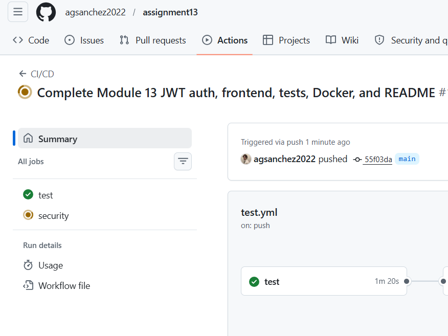
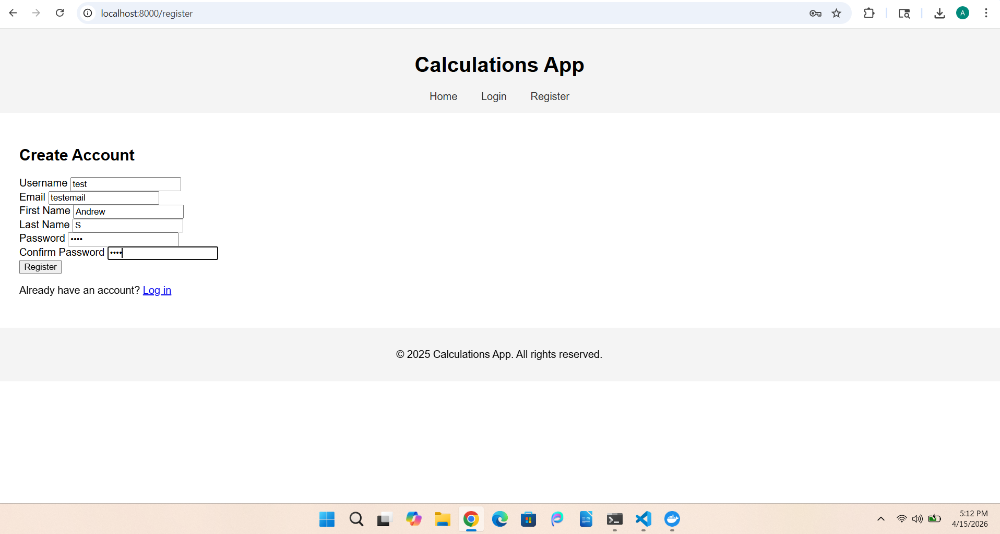
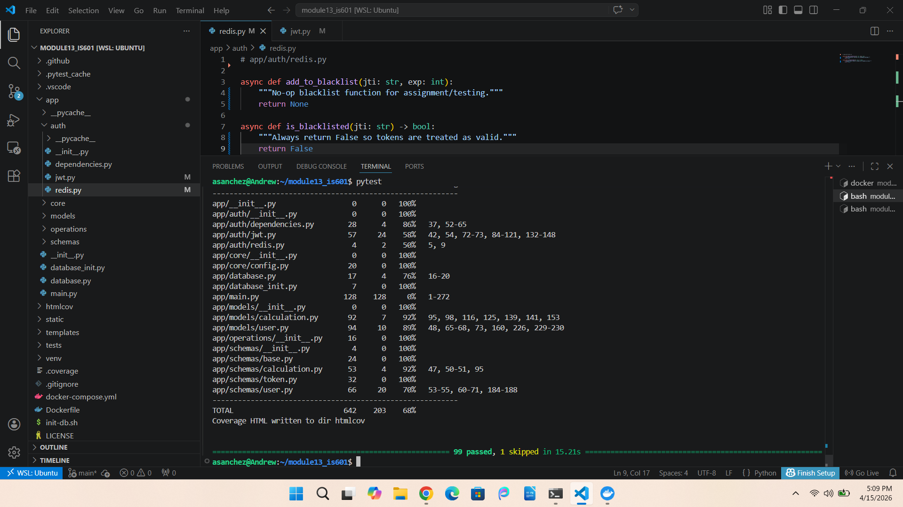

# Module 13 – JWT Authentication, Frontend Validation & E2E Testing
This project builds on the previous module by adding JWT-based authentication, frontend pages, and end-to-end testing. The backend is built using FastAPI, SQLAlchemy, and Pydantic, and now includes secure user registration and login using JWT tokens. It also includes frontend validation and automated testing with Playwright, along with Docker and CI/CD using GitHub Actions.

## 🧪 How to Run Tests Locally

1. Activate virtual environment:
```bash
source venv/bin/activate
```

2. Install dependencies:
```bash
pip install -r requirements.txt
```

3. Start Docker:
```bash
docker compose up -d
```

4. Run tests:
```bash
pytest
```

---

## 🐳 Docker Hub Repository

https://hub.docker.com/repository/docker/drew2026000000/module13_is601/general

---

## 📸 Screenshots

### GitHub Actions



### Application Running in Browser/VSCode:



---

## 📸 Reflection

This module helped me understand how authentication actually works in a real application. Before this, I had some idea of login systems, but implementing JWT made it more clear how tokens are created, stored, and used to protect routes.

Working on the frontend pages was also useful because it connected the backend to something more user-facing. Adding validation on the client side made the app feel more complete and realistic instead of just testing endpoints.

One of the main challenges I ran into was dealing with dependency issues and getting everything to work together, especially with authentication and testing. I had to troubleshoot errors related to libraries and environment setup, which took some time but helped me understand the system better overall.

Another important part was running tests with Docker and making sure everything worked in the CI/CD pipeline. Seeing all tests pass and the pipeline succeed made it feel like a complete working application.

Overall, this assignment helped me connect backend development, authentication, testing, and deployment into one project, which made it feel much closer to a real-world system.
